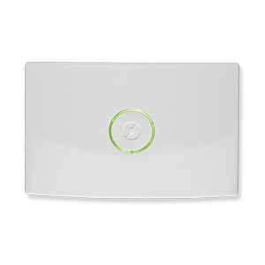

# NoboHub Binding

This binding controls the Glen Dimplex Nobø Hub using the <a href="https://www.glendimplex.se/media/15650/nobo-hub-api-v-1-1-integration-for-advanced-users.pdf">Nobø Hub API v1.1</a>.



It lets you read and change temperature and profile settings for zones, and read and set active overrides to change the global mode of the hub.

This binding is tested with the following devices:

* Thermostats for different electrical panel heaters
* Thermostats for heating in floors
* Nobø Switch SW 4

## Thermostats

Not all thermostats are made equal.

* NCU-1R: Comfort temperature setting on the device overrides values from the Hub, making the setting in the Hub useless.
* NCU-2R: Synchronizes temperature settings to and from the Hub.

## Supported Things

| Thing     | Thing Type | Description                                                                                     |
|-----------|------------|-------------------------------------------------------------------------------------------------|
| hub       | Bridge     | The Nobø Hub provides a gateway between your components, with the ability to organise in zones. |
| component | Thing      | A component is a device, i.e. panel heater or switch.                                           |
| zone      | Thing      | A zone can hold one or more components.                                                         |


## Discovery

The hub will be automatically discovered. 
Before it can be used, you will have to update the configuration with the last three digits of its serial number.

When the hub is configured with the correct serial number, it will autodetect zones and components (thermostats and switches).

## Thing Configuration

```
# Configuration for Nobø Hub
#
# Serial number of the Nobø hub to communicate with, 12 digits.
serialNumber=103000xxxxxx

# Host name or IP address of the Nobø hub
hostName=10.0.0.10
```

## Channels

### Hub

| channel             | type   | description                                         |
|---------------------|--------|-----------------------------------------------------|
| activeOverrideName  | String | The name of the active override                     |

### Zone

| channel                      | type               | description                                |
|------------------------------|--------------------|--------------------------------------------|
| activeWeekProfileName        | String             | The name of the active week profile        |
| activeWeekProfile            | Number             | The active week profile id                 |
| comfortTemperature           | Number:Temperature | The configured comfort temperature         |
| ecoTemperature               | Number:Temperature | The configured eco temparature             |
| currentTemperature           | Number:Temperature | The current temperature in the zone        |
| calculatedWeekProfileStatus  | String             | The current override based on week profile |

CurrentTemperature only works if the zone has a device that reports it (e.g. a switch).

### Component

| channel             | type               | description                              |
|---------------------|--------------------|------------------------------------------|
| currentTemperature  | Number:Temperature | The current temperature of the component |

Not all devices report this.

## Full Example

### nobo.things

```
Bridge nobohub:nobohub:controller "Nobø Hub" [ hostName="192.168.1.10", serialNumber="103000000000" ] {
	Thing zone      1               "Zone - Kitchen"      [ id=1 ]
	Thing component 184000000000    "Heater - Kitchen"    [ serialNumber="184000000000" ]
}
```

### nobo.items

```
// Hub
String              Nobo_Hub_GlobalOverride         "Global Override %s"                <heating>       {channel="nobohub:nobohub:controller:activeOverrideName"}

// Panel Heater
Number:Temperature  PanelHeater_CurrentTemperature  "Setpoint [%.1f °C]"                <temperature>   {channel="nobohub:component:controller:184000000000:currentTemperature"}

// Zone
String              Zone_ActiveWeekProfileName      "Active week profile name [%s]"     <calendar>      {channel="nobohub:zone:controller:1:activeWeekProfileName"}
Number              Zone_ActiveWeekProfile          "Active week profile [%d]"          <calendar>      {channel="nobohub:zone:controller:1:activeWeekProfile"}
String              Zone_ActiveStatus               "Active status %s]"                 <heating>       {channel="nobohub:zone:controller:1:calculatedWeekProfileStatus"}
Number:Temperature  Zone_ComfortTemperature         "Comfort temperature [%.1f °C]"     <temperature>   {channel="nobohub:zone:controller:1:comfortTemperature"}
Number:Temperature  Zone_EcoTemperatur              "Eco temperature [%.1f °C]"         <temperature>   {channel="nobohub:zone:controller:1:ecoTemperature"}
Number:Temperature  Zone_CurrentTemperature         "Current temperature [%.1f °C]"     <temperature>   {channel="nobohub:zone:controller:1:currentTemperature"}
```

### nobo.sitemap

```
sitemap nobo label="Nobø " {

    Frame label="Hub"{
      Switch   item=Nobo_Hub_GlobalOverride
    }

    Frame label="Main Bedroom"{
      Switch    item=Zone_ActiveStatus
      Text      item=Zone_ActiveWeekProfileName           
      Text      item=Zone_ActiveWeekProfile           
      Selection item=Zone_ActiveWeekProfile           
      Setpoint  item=Zone_ComfortTemperatur minValue=7 maxValue=30 step=1 icon="temperature"
      Setpoint  item=Zone_EcoTemperatur     minValue=7 maxValue=30 step=1 icon="temperature"
      Text      item=Zone_CurrentTemperatur
      Text      item=PanelHeater_CurrentTemperatur
    }
}
```

## Organize your setup

Nobø Hub uses a combination of status types (Normal, Comfort, Eco, Away), profiles types (Comfort, Eco, Away, Off), predefined temperature types (Comfort, Eco, Away), zones and override settings to organize and enable different features.
This makes it possible to control the heaters in many different scenarios and combinations. 
The following is a suggested way of organizing the binding with the Hub for a good level of control and flexibility.

If you own panels with a physical Comfort temperature override, you need to use the Eco temperature type for setting level used by the day based profiles. 
If not, you can use either Comfort or Eco to set wanted level.

Start by creating the following profiles in the Nobø Hub App:

    OFF                 Set to status off all day, every day.
    ON                  Set to status [Comfort|Eco] all day, every day
    Eco                 Set to status Eco all day, every day
    Away                Set to status Away all way, every day
    Weekday 06->16      Set to status [Comfort|Eco] between 06->16 every weekday, otherwise set to [Away|Off]
    Weekday 06->23      Set to status [Comfort|Eco] between 06->23 every weekday, otherwise set to [Away|Off]
    Weekend 06->16      Set to status [Comfort|Eco] between 06->16 in the weekend, otherwise set to [Away|Off]
    Weekend 06->23      Set to status [Comfort|Eco] between 06->23 in the weekend, otherwise set to [Away|Off]
    Every day 06->16    Set to status [Comfort|Eco] between 06->16 every day, otherwise set to [Away|Off]
    Every day 06->23    Set to status [Comfort|Eco] between 06->23 every day, otherwise set to [Away|Off]

Next set [Comfort|Eco] level for each zone to your requirements. 
For a more advanced setup, you can create a rule which both sets temperature level and profile.

Then create a sitemap with a Selection pointing to the Week Profile item. 
The binding will now automatically update all available week profile options in the selection button:

### nobo.sitemap

```
sitemap nobo label="Nobø " {

    Frame label="Main Bedroom"{
      Selection item=MainBedroom_Zone_WeekProfile   
    }
}
```
